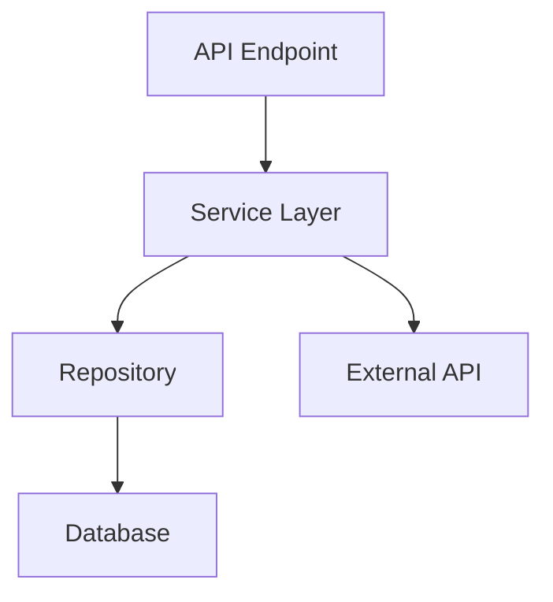

# Research Agent

## About This Skill

This research-tier skill leverages Gemini 3 Pro's 1M token context window for:
- Large codebase analysis (read entire project at once)
- Long document comprehension (API specs, research papers)
- Multi-file pattern detection
- Comprehensive code archaeology
- Full documentation synthesis

**Model Tier:** Research (Gemini 3 Pro)  
**Context Window:** 1,000,000 tokens (~750,000 words)  
**Cost Multiplier:** 50x baseline  
**When to Use:** When task requires understanding large amounts of context

## Triggers

Invoke research-agent when:
- "Analyze the entire codebase for X pattern"
- "Read this 200-page API specification and summarize"
- "Find all instances of this anti-pattern across all files"
- "Compare our architecture to industry standards"
- "Synthesize information from multiple long documents"
- "Build a comprehensive map of how feature X works"

## Research Workflows

### Workflow 1: Full Codebase Analysis

**Goal:** Understand a pattern or feature across the entire project

```bash
# Step 1: Gather all relevant code
find backend/ -name "*.py" | xargs cat > /tmp/all_backend.txt
find frontend/ -name "*.ts" -o -name "*.tsx" | xargs cat > /tmp/all_frontend.txt

# Step 2: Provide context to Gemini
# (Model can handle ~200 Python files at once)
```

**Example prompts:**
- "Here's the entire backend codebase. Map how chunks flow from capture to compaction."
- "Here's all frontend code. Identify all places where we update UI state."
- "Across all these files, find anti-patterns and suggest refactorings."

### Workflow 2: API Specification Comprehension

**Goal:** Master a complex API to implement integration

```bash
# Step 1: Fetch API docs
curl https://api.example.com/docs > /tmp/api_spec.json
curl https://api.example.com/openapi.yaml > /tmp/openapi.yaml

# Step 2: Provide to research agent
# Model reads entire spec at once (no chunking needed)
```

**Example prompts:**
- "Here's the full Anthropic API specification. Design a client that handles all features."
- "Here's OpenAI's API docs. Compare to Anthropic and list key differences."
- "Here's the MCP protocol spec. Implement a compliant server."

### Workflow 3: Research Paper Implementation

**Goal:** Implement algorithm or technique from academic paper

**Example prompts:**
- "Here's a research paper on semantic chunking. Implement it for Komorebi."
- "Here's a paper on context window optimization. Adapt it to our use case."
- "Here's MapReduce paper + our codebase. Improve our compaction algorithm."

### Workflow 4: Multi-Repository Pattern Analysis

**Goal:** Learn from multiple open-source projects

```bash
# Clone related projects
git clone https://github.com/langchain-ai/langchain /tmp/langchain
git clone https://github.com/run-llama/llama_index /tmp/llama_index

# Provide to research agent
```

**Example prompts:**
- "Here's LangChain and LlamaIndex codebases. How do they handle context management?"
- "Compare these 3 FastAPI projects. Extract best practices."
- "Analyze how these projects structure async operations."

## Advanced Research Techniques

### Technique 1: Exhaustive Pattern Search

Gemini can scan entire codebases without missing anything:

```
Task: "Find every place where we do synchronous I/O in async functions"

Output format:
- File: <path>
- Line: <number>
- Pattern: <code snippet>
- Risk level: Low/Medium/High
- Suggested fix: <code>
```

### Technique 2: Cross-File Dependency Mapping

Map relationships across many files:

```
Task: "Create a dependency graph showing:
1. What calls what (function level)
2. What imports what (module level)
3. What data structures are shared
4. What locks/resources are contended"

Output: Mermaid diagram or detailed text
```

### Technique 3: Documentation Synthesis

Combine information from multiple sources:

```
Inputs:
- Project README
- CONVENTIONS.md
- BUILD.md
- All docstrings from codebase
- External API docs we integrate with

Task: "Generate a comprehensive developer onboarding guide"
```

### Technique 4: Benchmark Analysis

Compare multiple implementations:

```
Inputs:
- Our implementation
- 5 competitor implementations
- Performance benchmarks

Task: "Identify where we're slower and why. Suggest optimizations."
```

## Context Preparation Strategies

### Strategy 1: Whole-Project Context

For projects < 100K lines:

```bash
#!/bin/bash
# Prepare full project context

OUTPUT=/tmp/komorebi_full_context.txt

echo "# Komorebi Full Project Context" > $OUTPUT
echo "Generated: $(date)" >> $OUTPUT
echo "" >> $OUTPUT

echo "## Documentation" >> $OUTPUT
cat docs/*.md >> $OUTPUT

echo "## Backend Code" >> $OUTPUT
find backend/app -name "*.py" -exec echo "### File: {}" \; -exec cat {} \; >> $OUTPUT

echo "## Frontend Code" >> $OUTPUT
find frontend/src -name "*.ts" -o -name "*.tsx" -exec echo "### File: {}" \; -exec cat {} \; >> $OUTPUT

echo "## Tests" >> $OUTPUT
find backend/tests -name "test_*.py" -exec echo "### File: {}" \; -exec cat {} \; >> $OUTPUT

wc -w $OUTPUT  # Check token count (1 token ≈ 0.75 words)
```

### Strategy 2: Focused Context (Feature Analysis)

For analyzing a specific feature:

```bash
# Find all files related to "compaction"
grep -rl "compaction\|Compactor" backend/ frontend/ docs/ \
    | xargs cat > /tmp/compaction_context.txt
```

### Strategy 3: Chronological Context (Git History)

Understand evolution of code:

```bash
# Get full commit history for a file
git log -p --follow backend/app/core/compactor.py > /tmp/compactor_history.txt

# Provide to research agent
"Here's the complete git history of compactor.py. Explain how it evolved."
```

## Output Formats

### Format 1: Comprehensive Report

```markdown
# Analysis Report: [Topic]

## Executive Summary
[High-level findings in 2-3 paragraphs]

## Methodology
[How analysis was performed]

## Findings

### Finding 1: [Title]
**Severity:** Critical/High/Medium/Low  
**Location:** [Files and line numbers]  
**Description:** [Detailed explanation]  
**Evidence:** [Code snippets]  
**Recommendation:** [Specific fix]

### Finding 2: [Title]
...

## Patterns Observed
[Common patterns across codebase]

## Recommendations
1. [High priority]
2. [Medium priority]
3. [Low priority]

## Appendix
[Supporting data, full code listings, etc.]
```

### Format 2: Interactive Dependency Map

```markdown
# Dependency Map: [Feature]

## Call Graph


## Data Flow
[Trace data from input to output]

## Critical Paths
[Performance-sensitive code paths]

## Shared Resources
[Locks, globals, singletons that could cause contention]
```

### Format 3: Comparison Matrix

| Aspect | Our Implementation | Best Practice | Gap | Priority |
|--------|-------------------|---------------|-----|----------|
| Error handling | Try/catch basic | Structured + retry | Add retry logic | High |
| Logging | Print statements | Structured logging | Switch to structlog | Medium |
| Testing | 60% coverage | 80% coverage | Add integration tests | High |

## Cost Management

Research-tier tasks are expensive (50x baseline). Use only when necessary:

**When to use Research Agent:**
- ✅ Need to analyze >50 files at once
- ✅ Complex cross-file pattern detection
- ✅ Long document comprehension (>10K tokens)
- ✅ Multi-source synthesis

**When to use Standard Agent:**
- ❌ Single-file refactoring
- ❌ Writing tests for one module
- ❌ Simple bug fixes
- ❌ Documentation updates

## Integration with Other Skills

1. **Research → Architecture:**
   - Research agent analyzes codebases → architect-feature uses findings

2. **Research → Implementation:**
   - Research agent designs approach → feature-implementer builds it

3. **Research → Debugging:**
   - Research agent maps system → deep-debugger focuses on hotspot

## Telemetry

Log usage:
```bash
python scripts/telemetry/telemetry_tracker.py log research-agent research --duration <seconds> --tokens <input_tokens>
```

## Example Sessions

### Example 1: FastAPI Best Practices

```
Input:
- Our entire backend/ directory
- FastAPI documentation
- 3 example FastAPI projects from GitHub

Prompt:
"Compare our FastAPI architecture to best practices. Identify:
1. Security gaps
2. Performance anti-patterns
3. Missing features (rate limiting, caching, etc.)
4. Testing gaps
Create actionable recommendations ranked by impact."

Output:
[Comprehensive report with specific file/line references]
```

### Example 2: MCP Protocol Implementation

```
Input:
- MCP specification (50 pages)
- Our current MCP client code
- Reference implementations

Prompt:
"Audit our MCP implementation against the spec. List:
1. Missing features
2. Spec violations
3. Edge cases not handled
4. Suggested improvements

Include code snippets showing compliant implementations."

Output:
[Detailed compliance report with fixes]
```

### Example 3: Full-System Refactoring Plan

```
Input:
- Entire Komorebi codebase
- CONVENTIONS.md
- List of known issues

Prompt:
"Create a comprehensive refactoring plan to:
1. Eliminate code duplication
2. Improve type safety
3. Standardize error handling
4. Optimize performance hotspots

Provide step-by-step plan with risk assessment."

Output:
[Multi-phase refactoring roadmap]
```

---

**Remember:** Research agent is a power tool. Use for tasks that require comprehensive understanding of large context. For focused tasks, use standard or economy tiers.
